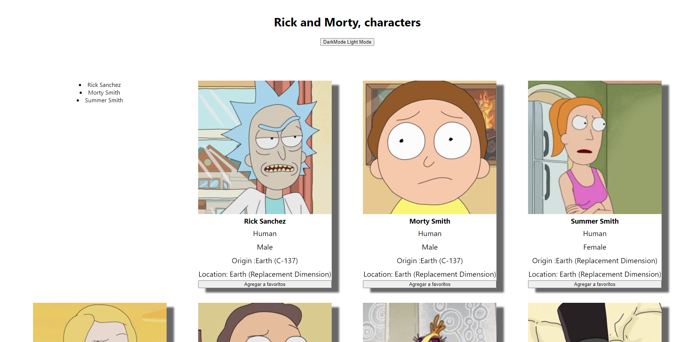

# Rick y Moti Personajes

## Primera version
Uso de UseState, useEffect y useContext para realizar un DarkMode

## Segunda version
Uso de useReducer para realizar una funcion de listado de personajes  favoritos

